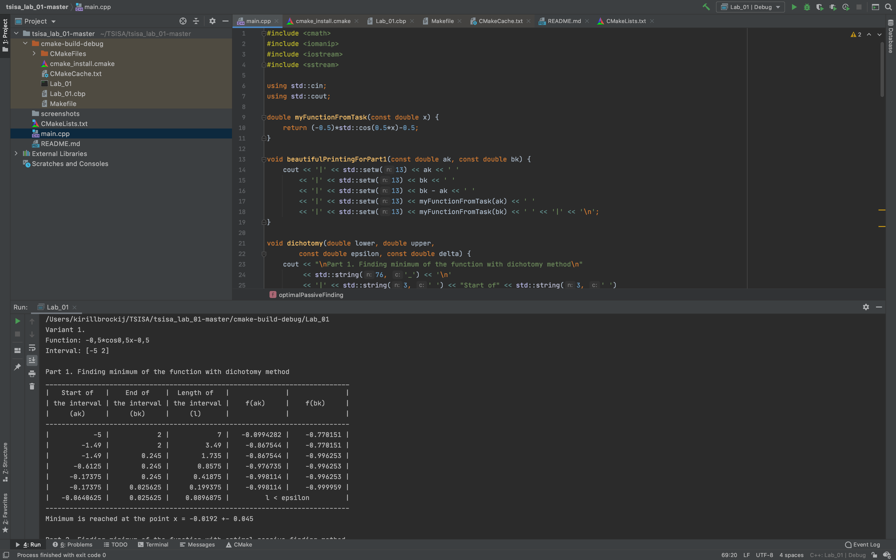

# Лабораторная работа №1 по Теории систем и системному анализу
Вариант 1

## Задание
На интервале [-5; 2] задана унимодальная функция одного переменного f(x) = (-0.5)*cos(0.5*x)-0.5.
Используя метод дихотомии, найти интервал нахождения минимума этой функции
при заданной наибольшей допустимой длине интервала неопределенности Е = 0,1.
Провести сравнение с методом оптимального пассивного поиска. 
Результат, в зависимости от числа точек разбиения N, представить в виде таблицы.

## Выполнение
Код файла, реализующего функции дихотомии и оптимального пассивного поиска,а также представляющего результаты в виде таблицы, приведен в main.cpp

## Контрольный вопрос
*В чем состоит сущность метода оптимального пассивного поиска?*

Минимаксный метод поиска, в котором информация о значениях функции, вычисленных в предшествующих точках, не может быть использована, называют оптимальным пассивным поиском.
Оптимальный пассивный поиск состоит в выборе точек, равномерно расположенных на отрезке. При этом дает оценку скорости сходимости пассивного поиска с ростом числа N точек, так как скорость сходимости любого метода прямого поиска можно характеризовать скоростью уменьшения интервала неопределенности с возрастанием N.

